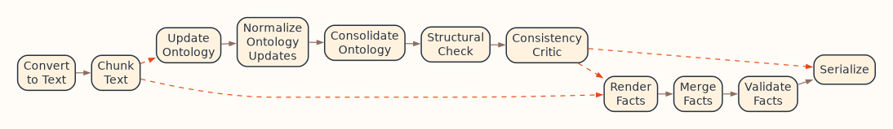
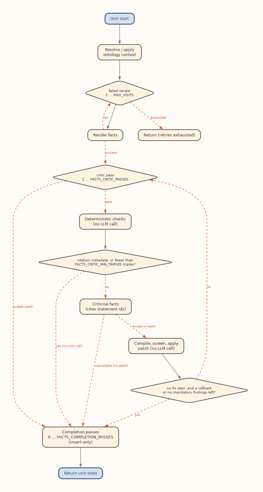

---
hide:
  - toc
---

# How OntoCast works

This page follows one document from the moment you send it to the moment its
graphs come back, so you can predict what a run does, what it costs, and which
setting changes which step.

<figure class="oc-figure oc-figure--wide" markdown>

<figcaption>The document pipeline. Dashed edges are decided by the render mode.</figcaption>
</figure>

## The steps at a glance

| Step | What happens | LLM calls |
|---|---|---|
| Convert | The file becomes text | None |
| Chunk | The text is cut into content units and labeled by section | None, unless `CHUNK_SECTION_CLASSIFIER=llm` |
| Ontology block | Each unit proposes changes to the ontology; the changes are merged and saved | At least one per unit |
| Facts block | Each unit's facts are extracted, then merged into one graph and validated | At least one per unit |
| Serialize | The graphs are stored and returned | None |

## Convert

OntoCast turns the input into text. PDF, Word, PowerPoint, Excel, HTML, Markdown, CSV, AsciiDoc and image files go through a
document converter (the `doc-processing` extra;
[`CONVERTER_SUPPORTED_EXTENSIONS`](../reference/configuration/conversion.md#converter_supported_extensions)
lists the suffixes); `.txt`, `.json` and `.jsonl` input is read as is. Each PDF is checked for a text layer
([`CONVERTER_PROFILE=auto`](../reference/configuration/conversion.md#converter_profile)): one with selectable text,
including a scan with an OCR layer, converts with OCR off; one whose pages are images only converts with OCR on.
Equations stay placeholders unless the `lean` profile or
[`CONVERTER_DO_FORMULA_ENRICHMENT`](../reference/configuration/conversion.md#converter_do_formula_enrichment)
decodes them to LaTeX, which runs a model per equation.

## Chunk

A document is too long for one prompt, so OntoCast cuts it into parts (content
units) of between
[`CHUNK_MIN_SIZE`](../reference/configuration/chunking.md#chunk_min_size) and
[`CHUNK_MAX_SIZE`](../reference/configuration/chunking.md#chunk_max_size)
characters. Cuts follow the document's sections, so no unit spans two of them,
and every unit carries the label of the section it came from, such as
`methods` or `results`.

Section labels decide what is extracted at all: reference lists are skipped by
default, and you can ask for only some sections of a document. [Structured
documents](structured_documents.md) explains labels, filters and the optional
per-unit summary.

From here on, every unit is processed on its own and in parallel, up to
[`PARALLEL_WORKERS`](../reference/configuration/pipeline.md#parallel_workers)
at a time.

## The ontology block

The ontology block grows the ontology the facts will be expressed in. It runs
when [`RENDER_MODE`](../reference/configuration/pipeline.md#render_mode) is
`ontology` or `ontology_and_facts`.

1. **Choose the ontology context.** Each unit is shown the slice of the catalog
   it needs: one ontology the model picks, the terms vector retrieval finds, or
   one fixed ontology, depending on
   [`ONTOLOGY_CONTEXT_MODE`](../reference/configuration/pipeline.md#ontology_context_mode).
   See [Choosing ontology context](../guides/ontology_context.md).
2. **Render.** The model reads the unit and its ontology context and proposes
   new classes and properties as a patch: triples to insert and triples to
   delete. With an empty catalog it starts a new ontology.
3. **Review.** An optional critic reviews the patch; see [the per-unit
   loop](#the-per-unit-loop) below.
4. **Merge and save.** When every unit is done, their patches are merged into
   one change per ontology. A triple one unit inserts wins over another unit's
   delete of it. Each new term goes to the ontology that owns its namespace,
   and every ontology that changed becomes a new version. What each unit
   contributed is kept apart from the ontology itself, as provenance.
5. **Consolidate (optional).** With
   [`ENABLE_ONTOLOGY_CONSOLIDATION`](../reference/configuration/pipeline.md#enable_ontology_consolidation),
   one more LLM call refines the ontology against an excerpt of the whole
   document. It runs only when the document produced exactly one ontology.
6. **Structural check.** OntoCast checks the ontology for disconnected parts and
   properties without labels. It changes nothing; problems are reported in
   `improvement_suggestions`.
7. **Consistency check.** In `selected_vector_search_ontology` mode, the new
   terms are searched against the whole catalog to find near-duplicates in
   ontologies the document did not touch. This is a retrieval, not an LLM call,
   and its findings are also reported in `improvement_suggestions`. In the other
   modes the step does nothing.

[Ontologies and facts](ontologies_and_facts.md) explains versions, patches and
provenance.

## The facts block

The facts block extracts what the document states, in the terms of the
ontology. It runs when `RENDER_MODE` is `facts` or `ontology_and_facts`.

1. **Choose the ontology context.** After an ontology block, every unit is shown
   the ontologies this document just updated. In `facts` mode each unit gets
   its own context, chosen as in the ontology block.
2. **Render.** The model extracts the unit's facts as a graph. Every new entity
   goes into the facts namespace `cd:`; the ontology's terms are only used,
   never changed. See [the two-namespace
   contract](ontologies_and_facts.md#facts-and-the-two-namespace-contract).
3. **Review.** Deterministic checks and the critic review the facts, and fixes
   are applied to the unit's graph; see [the per-unit loop](#the-per-unit-loop).
4. **Merge.** The units' graphs become one. Two units often describe the same
   thing under different names, so OntoCast decides which entities are the
   same and merges them; see [Entity disambiguation](entity_disambiguation.md).
5. **Validate.** The merged graph is checked as a whole: a property that may
   have one value but has two, one entity filling two single-valued roles of
   the same subject (a range whose bounds were merged), and, with shapes
   loaded, SHACL violations. A finding that points to a wrong
   merge undoes that merge. See [Validation and
   SHACL](../guides/validation.md).

## Serialize

The ontologies and the facts are written to the triple store (in memory, or
Apache Jena Fuseki; see [Triple stores](../guides/triple_stores.md)) and
returned as Turtle. Ontologies are stored as new versions; facts are stored in
a named graph of their own for each document. `/process` returns them with the
run's telemetry; `ontocast process` writes them to files, along with a run
manifest. See [Reading run telemetry](../guides/telemetry.md).

## Which blocks run

| `RENDER_MODE` | Ontology block | Facts block |
|---|---|---|
| `ontology_and_facts` (default) | Yes | Yes, against the updated ontologies |
| `ontology` | Yes | No; no facts are written |
| `facts` | No; the catalog is not changed | Yes, against the catalog as it is |

[Configuring OntoCast](../guides/configuration.md#choose-what-a-run-produces)
explains when to use each.

## The per-unit loop

Inside each block, every unit runs the same short loop:

<figure class="oc-figure oc-figure--aside" markdown>

<figcaption>The per-unit facts loop; click to enlarge. The ontology loop has the same shape, without the completion passes.</figcaption>
</figure>

- **Render** is one LLM call. If it fails outright (no usable output), it is
  retried up to
  [`MAX_VISITS_PER_NODE`](../reference/configuration/pipeline.md#max_visits_per_node)
  times. A render that succeeded is never repeated.
- **Review** is a critic pass: deterministic checks first, at no cost, then one
  LLM call to the critic, which points at the statements to fix. OntoCast
  applies the fixes itself, as a patch, without another LLM call, and undoes
  any fix that makes the unit worse. The loop stops early once another pass
  would see the same graph and findings.
- **How many passes** is set per block:
  [`FACTS_CRITIC_PASSES`](../reference/configuration/facts-validation.md#facts_critic_passes)
  (on by default) and
  [`ONTOLOGY_CRITIC_PASSES`](../reference/configuration/ontology-validation.md#ontology_critic_passes)
  (off by default).
- **Completion passes** (facts only, off by default) ask the model for
  measurements the render missed, adding facts and never removing any; see
  [`FACTS_COMPLETION_PASSES`](../reference/configuration/facts-validation.md#facts_completion_passes).

So at the defaults, an ontology unit costs one call and a facts unit usually
two, plus, in `selected_single_ontology` mode, one call per unit for choosing
the ontology.
[Validation layers](../internals/validation_layers.md) describes the checks, the
fixes and their limits in detail.

## Processing one unit

`POST /process_unit` and `run_unit_pipeline` run the per-unit loops on a
single piece of text, with no conversion, chunking or merging. Use them to
call OntoCast from your own pipeline, one passage at a time; see [Embedding
OntoCast in your agent](../guides/embedding.md).

## What to read next

- [Ontologies and facts](ontologies_and_facts.md): versions, patches, provenance and the facts namespace.
- [Structured documents](structured_documents.md): extracting from only some sections.
- [Entity disambiguation](entity_disambiguation.md): when two entities become one.
- [Glossary](glossary.md): the terms used across these pages.
