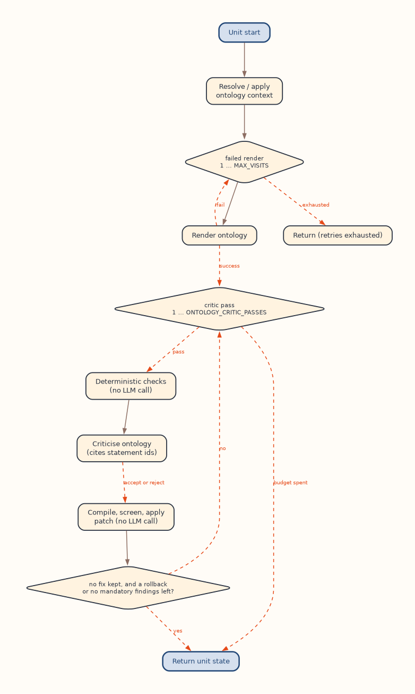

# Validation layers and the critic loop

This page describes how OntoCast checks and repairs what the model extracts:
the three validation layers, the per-unit render and critic loop with its
budgets, how a critique becomes a change to the graph, and what decides whether
a unit is accepted. [Validation and SHACL](../guides/validation.md) covers the
same ground from the user's side.

## The three layers

| Layer | Runs | Acts on | Module | LLM calls |
|---|---|---|---|---|
| 1. Parse-time repair | Inside every facts render | The rendered unit graph | `agent/render_facts.py`, `tool/facts_validation/literal_repair.py` | None |
| 2. Unit loop | Once per content unit, for facts and for ontology | The unit graph (facts) or the unit's delta (ontology) | `stategraph/atomic.py`, `tool/facts_validation/unit_findings.py`, `tool/ontology_validation/unit_findings.py`, `tool/facts_validation/critic_patch.py` | One per critic or completion pass |
| 3. Post-merge gate | Once per document, after aggregation (`VALIDATE_FACTS`, and the same gate on `/process_unit`) | The merged facts graph | `stategraph/facts_gate.py`, `tool/facts_validation/gate.py`, `tool/facts_validation/shacl.py` | None |

Ontology output has its own document-level checks after the unit loop: the
reduce-time policies, `STRUCTURAL_CHECK` and `CONSISTENCY_CRITIC`, all without
LLM calls ([below](#ontology-checks-after-the-unit-loop)).

No layer withholds output. A unit that leaves the loop without being accepted
keeps its graph: the reduce merges it and logs it as salvaged from a
non-converged loop. The gate serves the facts it repaired, with the remaining
findings attached.

## The unit loop

Each content unit runs one loop per phase, written once in
`run_unit_loop` and parameterized by a `LoopPhase` (`FACTS_PHASE`,
`ONTOLOGY_PHASE`) that names the agents, the validator, the budgets and the
policies.

<figure class="oc-figure oc-figure--tall" markdown>

<figcaption>The facts loop for one content unit. Dashed edges are decisions; only the render, critic and completion steps call the model.</figcaption>
</figure>

1. **Resolve the ontology context** for the unit. For facts under per-unit
   shapes selection, the unit's shapes chapter is chosen from it here.
2. **Render.** A render that fails outright (no parseable output) is retried up
   to [`MAX_VISITS_PER_NODE`](../reference/configuration/pipeline.md#max_visits_per_node)
   (alias `MAX_VISITS`) times. A render that succeeds is never repeated:
   re-extracting a whole unit to fix a local defect costs a full call and
   brings new defects of its own. When web search is enabled and the failed
   render asked for it, the evidence is fetched and the render retried once
   within the same attempt.
3. **Critic passes**, up to the phase's budget. Each pass:
    1. collects the deterministic findings against the current graph (no call);
    2. checks whether the critic may be skipped (facts only, below);
    3. calls the critic, which sees the graph with numbered statements, the
       findings, the source text and, for facts, the shapes chapter;
    4. compiles the critique into one patch per fix, screens it, and applies
       the fixes one at a time (no call);
    5. re-derives acceptance from the patched graph.
4. **Completion passes** (facts only), when enabled and measurements are still
   missing.

A pass ends the loop early when it kept no fix and either rolled one back or
left no mandatory finding: the next pass would see the same graph and the same
findings, and pay for the same answer. If the critic call fails (timeout,
unparseable response), no patch is applied, the render is kept unreviewed, and
the unit leaves the loop marked failed at the critique stage.

### Budgets

- **`FACTS_CRITIC_PASSES`** defaults to 1, so a facts unit costs two calls: one
  render, one review. `0` leaves the findings to layers 1 and 3. In the default
  `selected_single_ontology` context mode each unit also makes one ontology
  selection call, counted as `llm/ontology_selection` in `budget.counters`.
- **`FACTS_CRITIC_MIN_TRIPLES`** skips the critic for a render with fewer
  triples; at the default it skips exactly the empty renders, which a critic
  would score perfect for nothing. Citation-metadata units are skipped too. A
  skip is recorded as `critic_skipped` and bills no call.
- **`ONTOLOGY_CRITIC_PASSES`** defaults to 0. The ontology loop then costs one
  call per unit, and its findings are collected once at the end for telemetry.
- **`FACTS_COMPLETION_PASSES`** defaults to 0 ([below](#completion-passes)).

All four are documented in the [facts-validation](../reference/configuration/facts-validation.md)
and [ontology-validation](../reference/configuration/ontology-validation.md)
references.

### The ontology loop

<figure class="oc-figure oc-figure--tall" markdown>

<figcaption>The ontology loop for one content unit.</figcaption>
</figure>

The ontology loop is the same loop with these differences:

- It renders against a copy of the unit's ontology snapshot and validates the
  unit's net insert/delete **delta**, never snapshot plus delta: that would
  attribute every existing catalog defect to the unit.
- It has no skip rule and no completion pass.
- Patches go through the unit's update channel, so the delta built at reduce
  time includes them; an update the channel refuses leaves the graph unchanged.
- The critic sees the retrieved catalog for judging term choices, but only the
  delta's statements carry ids, so a fix cannot delete shared catalog content.
- A rename is never allowed, and the delete limits are stricter
  (`ONTOLOGY_CRITIC_MAX_DELETE_SHARE`, `ONTOLOGY_CRITIC_MIN_DELETES`), because an
  ontology delete propagates to every document that uses the term.
- Under `selected_vector_search_ontology`, the render and critic prompts carry
  a partial-context notice: a term absent from the prompt may simply not have
  been retrieved.

## Layer 1: parse-time repairs

After a facts render is parsed, `_normalize_and_repair_graph` rewrites what a
machine can decide without the model:

| Repair | What it does |
|---|---|
| Numeric retyping | An untyped number on a property with a numeric range gets that datatype |
| `rdf:type` literal coercion | A type written as a string becomes the class IRI when it resolves unambiguously |
| Near-miss predicate rewrite | A predicate not in the catalog is rewritten to the one catalog term whose name tokens contain, are contained in, or equal its own. `FACTS_PROPERTY_ALIAS_MIN_RATIO` only breaks ties among such candidates; string similarity alone never triggers a rewrite. A predicate the full catalog declares is never rewritten, even when the unit's snapshot lacks it |
| Code resolution | A node carrying a code from `FACTS_CODE_PREDICATES` (such as `qudt:ucumCode "d"`) but no link to the coded individual gains that link, when exactly one catalog individual declares the code. The linking property comes from the schema's domain and range, or else from how the graph already links such nodes |
| Degenerate bounds | Equal lower and upper bounds become one value, when the quantity fallback vocabulary names `numeric_value`, `lower_bound` and `upper_bound` |

Two kinds of triple are then **quarantined**, removed from the graph and shown
to the critic for repair: typed literals whose lexical form is invalid for the
datatype, and string literals on a property whose range is a class
(`FACTS_OBJECT_PROPERTY_LITERAL_CHECK`).

Type coercions, predicate rewrites and code resolutions are recorded as
`GraphRepairRecord`s and returned per unit as `facts_repairs`, so a consumer can
tell a machine rewrite from what the model asserted. Ambiguity is never
resolved by guessing: two catalog terms claiming one code means no repair.

## Layer 2: findings and the critic

### Facts findings

`collect_unit_findings` runs before every critic call and after every applied
fix. Every kind is mandatory except numeric coverage:

| Finding | What it catches |
|---|---|
| `quarantined_literal` | A quarantined triple, with the catalog individuals of the property's range as suggestions |
| `unknown_term` | A term under `example.org`, a predicate or class minted in the facts namespace, or a term missing from a closed catalog namespace |
| `literal_type_object` | An `rdf:type` written as a string that layer 1 could not resolve |
| `domain_violation` | A predicate asserted on a subject whose stated type contradicts the predicate's `rdfs:domain` |
| `domain_adherence` | Too few of the render's schema terms come from the ontology context (`FACTS_DOMAIN_ADHERENCE_MIN_SHARE`, judged from `FACTS_DOMAIN_ADHERENCE_MIN_TERMS` terms up); not judged on citation or non-content units |
| `scalar_as_bounds` | One value written into two single-valued numeric properties of one node |
| `label_only_number` | A value node with a unit but no numeric literal, whose number sits only in its label |
| `unit_symbol_case_mismatch` | A unit whose symbol matches the text only after case folding, while another catalog unit matches it exactly |
| `numeric_coverage` | Numbers in the source text missing from the graph, split into measurements (number with unit) and bare numbers. Advisory unless `FACTS_NUMERIC_COVERAGE_MANDATORY` says otherwise; `FACTS_NUMERIC_IDENTIFIER_GUARD` keeps digit groups of identifiers out |

The critic is told to resolve every mandatory finding by rewriting the
statement in place, never by deleting it.

### Which terms count as unknown

A namespace is **closed**, so that a member the catalog does not list is
reported, only when the ontology context *declares* terms in it (uses them as
subjects). A namespace the catalog only references, such as `qudt:` in an
`rdfs:subClassOf` or `owl:onProperty`, is a borrowed vocabulary and stays open.
Membership is checked against the whole catalog, not the unit's snapshot: a
term retrieval did not bring into the unit is still a term.

Never reported as unknown: the built-in meta-vocabularies (RDF, RDFS, OWL, XSD,
SKOS, Dublin Core, PROV), `FACTS_ADDITIONAL_STANDARD_NAMESPACES`, the terms of
`FACTS_QUANTITY_FALLBACK_VOCABULARY` (the prompt recommends them),
`FACTS_CODE_PREDICATES`, and every term the SHACL shapes require. Replacement
candidates are offered only by token containment and filtered by role, so a
property is never offered as a class or the reverse.

At the gate, the shapes are cross-checked against these rules: a property the
shapes require that the term validator would flag is logged as an error once
per document, because no data can satisfy both.

### Ontology findings

`collect_ontology_unit_findings` runs on the delta. Every kind is mandatory
except `label_collision`:

| Finding | What it catches |
|---|---|
| `foreign_namespace` | A term minted under a namespace no context ontology declares terms in; the reduce would drop it as unattributable. Also `example.org` terms and ontology terms minted in a facts namespace |
| `foreign_delete` | A delete of catalog content whose subject the unit does not redeclare |
| `subclass_cycle` | An inserted `rdfs:subClassOf` that closes a cycle through snapshot and delta |
| `role_confusion` | A catalog class used as a property, or a catalog property used as a class |
| `degenerate_restriction` | An `owl:Restriction` with too few meaningful predicates to constrain anything |
| `cardinality_contradiction` | A functional or max-1 declaration contradicted by a minimum cardinality of 2 or more |
| `missing_label` | A new class or property without `rdfs:label` or `skos:prefLabel` |
| `label_collision` (advisory) | A new term whose label equals an existing term's in the snapshot |

`unknown_term` has no ontology counterpart, since minting terms is the ontology
render's job, and connectivity is left to `STRUCTURAL_CHECK`.

### How a critique reaches the graph

The critic cites statements by id. Every statement of the facts graph, and of
the ontology delta, carries a number in the critic's prompt (inline in Turtle,
in a `TRIPLE INDEX` table in JSON-LD). A fix names the ids in `triple_ids`:
`REMOVE` cites ids, `REPLACE` cites ids and supplies `correct_value`, `ADD`
supplies only `correct_value`. A fix that cites no id falls back to quoting the
statement in `incorrect_value`, which must match the stored triples exactly.

`compile_critic_fixes` turns each fix into a delete-then-insert patch, with no
LLM call. Payloads are parsed format-tolerantly: a Turtle payload under a JSON-LD
deployment, or a JSON-LD term object inside Turtle, is mapped to the equivalent
Turtle. A fix goes back unapplied, counted as residual, when it cites an id the
index never issued, names a prefix nothing declares, holds an invalid typed
literal, or would mint a placeholder subject (a name for an ignored token, or a
new node with annotations and no type). A fix that removes exactly what it
re-adds is counted as a no-op.

Screening then withholds what a pass may not destroy:

| Rule | Why |
|---|---|
| Deletes only by cited id or exact quote | A statement the critic was not shown cannot be removed |
| `FACTS_CRITIC_MAX_DELETE_SHARE`, with a `FACTS_CRITIC_MIN_DELETES` floor | Past the share a critique is rewriting, not correcting; over it, every fix that deletes goes back whole and only pure additions are kept. The floor keeps short units correctable |
| A `REMOVE` may not empty a subject | Removing the last statement about a node deletes the node |
| A `REPLACE` may not write about a different subject than it deletes | That is a rename: it orphans the old node and leaves the new one bare. `FACTS_CRITIC_ALLOW_SUBJECT_RENAME` opts in (facts only) |
| A blank node is deleted whole or not at all | A partial delete leaves a stub |

The surviving fixes are applied **one at a time**, each judged against the graph
the previous kept fix left. A fix is rolled back on its own when it:

- deleted and wrote nothing (`delete_only`), judged against what the fix
  declared it writes, so a `REPLACE` whose replacement was already present is
  not mistaken for a bare delete;
- created mandatory findings (`new_mandatory`);
- shrank the unit without resolving anything (`no_progress`).

An applied or rolled-back fix is not requested again. In the facts phase,
applied critic fixes are recorded as `critic_fix` repair records.

### What makes a unit acceptable

Acceptance is `material_defects()` over evidence that can be pointed at:

| Signal | Blocks? |
|---|---|
| Mandatory deterministic finding (facts) | Always |
| Ontology finding in `ONTOLOGY_ACCEPT_BLOCKING_FINDING_KINDS` | Yes; the default set is `foreign_delete`, `foreign_namespace`, `subclass_cycle`, `role_confusion` |
| Critic fix at or above `FACTS_ACCEPT_BLOCKING_SEVERITY` (default `critical`; applies to both phases) | Yes |
| Critic fix with action `REMOVE` | Never: a deletion is never worth holding a unit back for |
| Advisory findings | No |
| The critic's `score` and `success` | No; recorded as telemetry only |

`FACTS_ACCEPT_BLOCKING_SEVERITY=never` lets deterministic findings decide
alone. Acceptance is decided when the critique arrives and re-derived after the
patch, from the post-patch findings and the fixes still outstanding. It sets the
unit's status, which the reduce reads for its salvage count, and a rejected
critique may trigger the critic's web-evidence retry; it never discards the
unit's output. `facts_critic_accepted` counts the critic calls that accepted.
The ontology critic also records, as `incumbent_accepted` on each attempt, what
a score rule (`success`, or a score above 90) would have decided.

### Completion passes

The critic judges whether what was rendered is right, not whether something is
missing. `FACTS_COMPLETION_PASSES` adds insert-only passes after the critic
loop, run only while the numeric inventory still lists a measurement (a number
with its unit) absent from the graph. Each pass:

- shows the model a term sheet (the unit's quantity, observation and condition
  classes and unit individuals) instead of the full ontology chapter, plus the
  unit's existing catalog-typed subjects, so a recovered measurement attaches
  to a node that is already there;
- keeps only `ADD` fixes, whatever else the model returns;
- applies them through the same one-at-a-time regression check as critic
  fixes.

The passes stop as soon as nothing is missing.

## Layer 3: the post-merge gate

`run_facts_gate` runs on the aggregated graph, in this order:

1. **Literal variants** that differ only in language tag or datatype on one
   subject and predicate are collapsed (`FACTS_LITERAL_VARIANT_DEDUPE`): the
   language-tagged form wins, then the plain one, and provenance moves to the
   survivor.
2. **Invariant checks** (`validate_aggregated_facts`), reported only for
   subjects in the facts namespaces:

    | Finding | Severity | Acted on by |
    |---|---|---|
    | `functional_violation`: two or more objects on a functional or max-1 property | error | un-merge |
    | `suspect_multi_value`: two numeric values on one property; irreconcilable short strings on a property that is single-valued for most subjects; or two IRIs on such a property | `FACTS_SUSPECT_MULTI_VALUE_SEVERITY` | un-merge when an error |
    | `degenerate_coreference`: one IRI object shared by two single-valued properties of a subject | error | un-merge |
    | `shacl` | from the shape | autofix |
    | `non_catalog_vocabulary` | warning | reported (a retrieval miss) |
    | `dangling_reference` | warning | reported |
    | `mixed_object_kinds`: a property used with both IRI and literal objects | warning | reported |

    String values on a cluster confirmed by a natural key are reported as
    warnings. With `FACTS_SUSPECT_MULTI_VALUE_REQUIRE_CROSS_UNIT`, two IRI
    objects asserted by a single unit are a warning: only objects from
    different units can come from a bad merge.
3. **Un-merge repair** (document path only). The first three kinds are merge
   signatures: two things that are not the same got one IRI. Their clusters
   become pair vetoes and the units are re-aggregated, up to
   `FACTS_MERGE_REPAIR_PASSES` times; a pass is kept only if the
   merge-signature error count strictly drops. SHACL findings never drive this
   loop: a missing property says a node is under-specified, not that two
   entities were confused.
4. **SHACL autofix** (`apply_shacl_repairs`), on the graph that will be served,
   reusing the violations already computed. The modes and their guards are in
   [Validation and SHACL](../guides/validation.md#llm-free-autofix). A pass is
   kept only if the violation count drops. A prune also removes a referrer the
   prune leaves empty, and repairs touch only nodes in the facts namespaces.
   Rewrites move the statement's RDF 1.2 reifier onto the replacement; prunes
   delete it.
5. **Summary**: `facts_conformance`, `facts_validation_findings` and
   `facts_gate_repairs`, plus the gate counters in `retrieval_metrics`.

SHACL runs on a copy of the data graph with the ontology context mixed in and
`FACTS_SHACL_INFERENCE` applied. Shapes come from the shapes partition and from
any `sh:NodeShape` inline in the ontology context. `/process_unit` runs the same
gate without step 3, since one unit has nothing to un-merge.

## Ontology checks after the unit loop

The per-unit snapshot under `selected_vector_search_ontology` is a retrieved
subset of the catalog, so judgments that need the whole catalog run at the
reduce step, where the full catalog terminals are loaded:

| Policy | Behavior | Counter |
|---|---|---|
| Minted-term reconciliation (`ONTOLOGY_RECONCILE_MINTED_TERMS`, default `detect`) | A new term whose label, preferred label or notation exactly matches a catalog term of compatible role is a re-mint of a term retrieval did not surface. `detect` logs the pairs, `rewrite` substitutes the catalog IRI in the merged update, `off` skips the check | `minted_duplicates`, `minted_duplicate_pairs`, `minted_duplicates_rewritten` |
| Delete policy (vector mode only) | A merged delete whose subject the merged inserts do not redeclare is dropped: it was judged on partial evidence and would change shared catalog terms | `deletes_dropped_unredeclared` |
| Fresh-ontology reconciliation | Units that each created an ontology under the same IRI are union-merged into one; overlap between different fresh IRIs is counted, not merged | `fresh_ontologies_merged`, `fresh_minted_duplicates` |

Applying the merged delta also counts where the unit's view and the catalog
diverged: `apply_deletes_no_match` (delete triples absent from the catalog at
apply time, typically a stale vector index) and
`unattributed_insert_triples` / `unattributed_delete_triples` (triples no
writable ontology claims, the loss `foreign_namespace` predicts).

These counters are kept in `AgentState.ontology_reduce_metrics` and written to
the run manifest of `ontocast process` under `ontology_reduce_metrics`. The
`/process` response does not include them. A minted duplicate also logs a
warning naming both IRIs.

After reduction, `STRUCTURAL_CHECK` checks each resulting ontology for
disconnected components and unlabeled predicates, and `CONSISTENCY_CRITIC`
(vector mode only) re-queries the vector store for terms that look like ones in
an ontology the document did not use. Both add to `improvement_suggestions`
and change nothing.

## Telemetry

Per-unit attempt logs feed the `critic`, `ontology_critic` and `completion`
blocks of the run manifest; `retrieval_metrics` carries the per-document totals
(`facts_critic_calls`, `facts_critic_accepted`,
`facts_critic_patches_rolled_back`, `facts_mandatory_residual`,
`ontology_mandatory_residual`, the `facts_shacl_*` and `facts_merge_*`
counters). [Reading run telemetry](../guides/telemetry.md) explains them.
