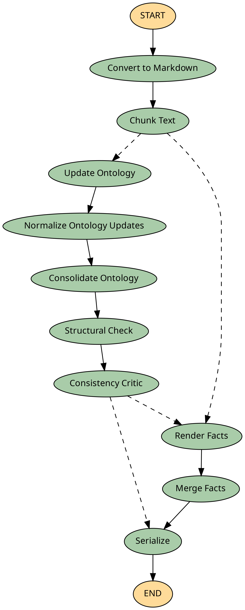
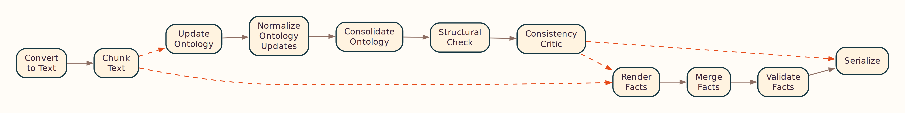
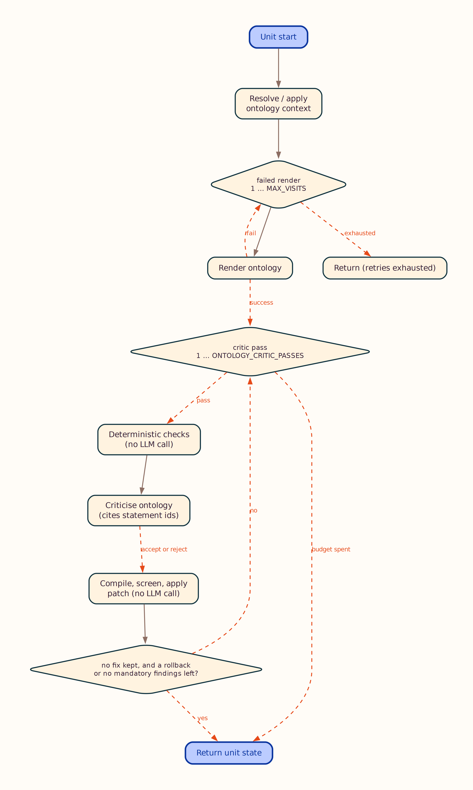
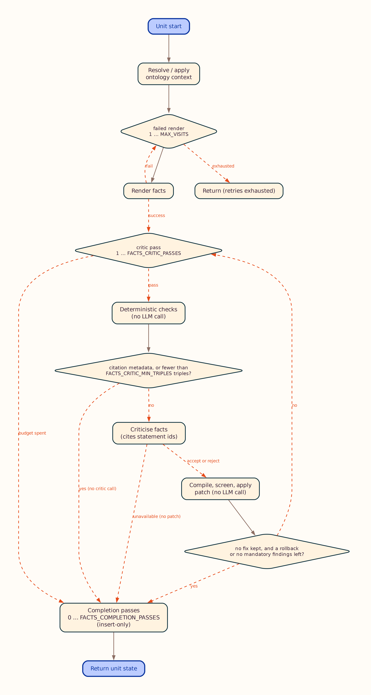
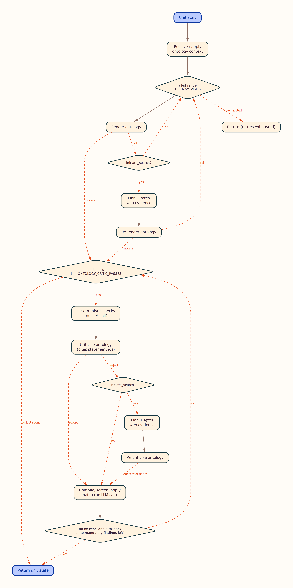
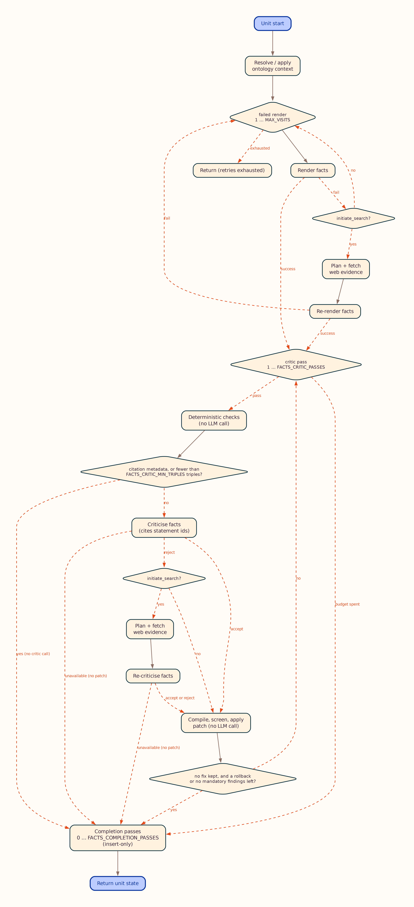

# OntoCast Workflow

This document describes the document processing pipeline implemented in `stategraph/create.py`. After changing the node topology, regenerate workflow diagrams with `uv run plot-graph`.

## Overview

OntoCast transforms input documents into RDF ontology and facts graphs through a **parallel map/reduce** pipeline:

1. **Document conversion** — PDF, DOCX, TXT, MD, or JSON → Markdown
2. **Chunking** — prepare pipeline (segment, tag, filter, size) into content units (`--head-chunks` limits count for testing). Section tagging runs by default (`CHUNK_SECTION_CLASSIFIER`); `target_sections`/`exclude_sections` filter inside **Chunk**; optional per-unit summarization runs inside the extraction fan-out (see [Structured documents](concepts.md#structured-documents))
3. **Ontology map/reduce** (when `render_mode` includes ontology):
   - Per-unit context assembly (catalog selection or vector retrieval)
   - Render/critic loops with optional web evidence
   - Reduce: each unit's `GraphUpdate`s replay against its prompt snapshot into a net insert/delete delta; deltas union across units (a triple inserted by any unit vetoes another unit's delete of it), partition by namespace ownership, and apply delete-first onto the owning catalog terminals
   - Global normalize (provenance split) → optional consolidate → structural check → consistency critic
4. **Facts map/reduce** (when `render_mode` includes facts):
   - Per-unit render/critic loops
   - Merge facts across units with entity disambiguation
5. **Serialize** — write to triple store and return Turtle in the API response

## Document-Level Graph

The LangGraph compiled by `create_agent_graph()` is rendered from the live workflow. Regenerate after graph changes:

```bash
uv run plot-graph
```

Outputs (under `docs/assets/`):

| File | Layout | Description |
|------|--------|-------------|
| [graph.png](../assets/graph.png) | Top-to-bottom | Full document pipeline (default) |
| [graph.lr.png](../assets/graph.lr.png) | Left-to-right | Same graph, landscape layout |
| [graph.svg](../assets/graph.svg) / [graph.lr.svg](../assets/graph.lr.svg) | Vector | Scalable versions |
| [graph.mmd](../assets/graph.mmd) | Mermaid source | Editable Mermaid source |



<details>
<summary>Landscape layout (LR)</summary>



</details>

Nodes such as **Update Ontology** and **Render Facts** each run the per-unit atomic loop below (in parallel across content units).

## Per-Unit Atomic Loop

Inside `stategraph/atomic.py`, each content unit runs an independent **render → critic** loop. Ontology and facts share the same control flow; optional web-evidence branches are omitted in the default diagrams below (see `_evidence` variants).

Outputs (under `docs/assets/`):

| File | Layout | Description |
|------|--------|-------------|
| [ontology_loop.png](../assets/ontology_loop.png) | Top-to-bottom | Per-unit ontology loop (core path) |
| [ontology_loop.lr.png](../assets/ontology_loop.lr.png) | Left-to-right | Ontology loop, landscape layout |
| [ontology_loop.svg](../assets/ontology_loop.svg) / [ontology_loop.lr.svg](../assets/ontology_loop.lr.svg) | Vector | Scalable ontology loop |
| [ontology_loop.mmd](../assets/ontology_loop.mmd) | Mermaid source | Core ontology loop source |
| [ontology_loop_evidence.mmd](../assets/ontology_loop_evidence.mmd) | Mermaid source | Full ontology loop with web evidence |
| [facts_loop.png](../assets/facts_loop.png) | Top-to-bottom | Per-unit facts loop (core path) |
| [facts_loop.lr.png](../assets/facts_loop.lr.png) | Left-to-right | Facts loop, landscape layout |
| [facts_loop.svg](../assets/facts_loop.svg) / [facts_loop.lr.svg](../assets/facts_loop.lr.svg) | Vector | Scalable facts loop |
| [facts_loop.mmd](../assets/facts_loop.mmd) | Mermaid source | Core facts loop source |
| [facts_loop_evidence.mmd](../assets/facts_loop_evidence.mmd) | Mermaid source | Full facts loop with web evidence |





<details>
<summary>Full loops with optional web evidence</summary>





</details>

Notes:

- Core diagrams show the default path: render/critic retries without web search. When a node sets `initiate_search`, plan/fetch/retry branches apply — see `*_evidence.mmd` (and matching PNG/SVG).
- First render/critic pass always runs **without** web search; search runs only when the node sets `initiate_search`.
- On the **last allowed render attempt**, the critic is skipped (no further extract to critique). The facts loop also surfaces unresolved quarantined literals on that path.
- In the **facts** loop a rejecting critic does not escalate to another render. Its blocking fixes are converted to findings and applied by the bounded rewrite-in-place repair pass, so the outer loop retries only on render *failure* and a unit's worst-case call count is flat in `MAX_VISITS`. Acceptance is decided by `material_defects()` — mandatory deterministic findings plus critic fixes at `FACTS_ACCEPT_BLOCKING_SEVERITY` — not by the critic's score. The ontology loop still uses the score threshold, having no deterministic finding lane.
- `/process_unit` runs this loop on a single unit via `unit_pipeline.py` (no chunking or document-level reduce).

Implementation: [`stategraph/atomic.py`](../reference/stategraph/atomic.md).

## Stage Details

### 1. Document Input

- Accepts text, JSON (`text` field), or file uploads via `/process`
- Converts supported formats to Markdown while preserving structure
- PDF conversion quality can be tuned via `CONVERTER_*` settings; use `CONVERTER_PROFILE=born_digital` for text-selectable publisher PDFs with ligature-gap artifacts

### 2. Chunking (and optional structured preprocessing)

Default path: **Convert** → **Chunk** → extraction.

When `target_sections` and/or `summarize_sections` are set on `/process` or CLI (`--target-sections`, `--summarize-sections`):

| Node | When | What it does |
|------|------|----------------|
| **Chunk** | Always | Prepare pipeline: Docling segments (or semantic fallback), optional tag/filter/size; builds `content_units` |

Summarization has **no node of its own**. When `summarize_sections` is set, each
unit is summarized inside the extraction fan-out, immediately before that unit is
rendered; prompts then use `extraction_text`, which prefers the summary. A unit's
summary depends only on that unit, so a separate stage was a barrier that made
every unit wait for the slowest summary before any extraction could start.

- Section LLM tagging during Chunk uses **parallel** workers up to `PARALLEL_WORKERS`
- Use `--head-chunks N` on the CLI to process only the first N units (testing)
- Without section parameters, Chunk uses layout/simple sizing only (no tag/filter)

### 3. Per-Unit Ontology Loop

Each content unit runs an independent **ontology loop** (`stategraph/atomic.py`):


1. **Context assembly** — pick or retrieve ontology context for the unit:
   - LLM catalog selection (`selected_single_ontology`)
   - Vector-store ensemble (`selected_vector_search_ontology`; Qdrant or LanceDB)
   - Fixed catalog ontology (`fixed_single_ontology`)
2. **Render** — LLM emits `GraphUpdate` operations (JSON-LD by default, or Turtle; see `LLM_GRAPH_FORMAT`)
3. **Critic** — validate structure; retry up to `max_visits` (config or per-request override)
4. **External evidence** (optional) — web search on retry when the node requests it

See [Ontology Context](ontology_context.md) and [User Instructions](user_instructions.md).

### 4. Ontology Reduce (Document Level)

After all units finish:

| Stage | Purpose |
|-------|---------|
| **Normalize** | Merge unit deltas; split RDF 1.2 provenance/reification into a side artifact |
| **Consolidate** (optional) | Single-pass refinement when `ENABLE_ONTOLOGY_CONSOLIDATION=true` |
| **Structural check** | Connectivity and schema validation |
| **Consistency critic** | Cross-unit ontology consistency. Runs **only** under `ONTOLOGY_CONTEXT_MODE=selected_vector_search_ontology` — a no-op in the other two modes |

Provenance triples (`prov:`, reification, chunk metadata) are kept in `ontology_provenance_artifact`, not in the working ontology graph passed to consolidation.

### 5. Per-Unit Facts Loop

When facts rendering is enabled, each unit runs a **facts loop** (render → critic, with optional web evidence), then **merge facts** applies cross-chunk entity disambiguation and aggregation, and **validate facts** checks post-merge invariants (functional violations, suspect multi-values, degenerate coreference, optional SHACL). Merge-signature error findings (functional violation, suspect multi-value, degenerate coreference — never SHACL) on merged subjects trigger a deterministic un-merge: the offending cluster's pairs are vetoed and the retained facts units are re-aggregated (`FACTS_MERGE_REPAIR_PASSES`). Residual findings land in `facts_validation_findings` and the retrieval metrics.

Chunks detected as bibliography/reference lists are routed by `CHUNK_BIBLIOGRAPHY_MODE`: by default they are dropped before extraction (`skip`); `citations_only` yields citation metadata only (`schema:ScholarlyArticle` + `schema:citation`), never domain facts mined from citation titles.


Facts output uses the **`cd:` namespace** for text-derived instances; domain ontology IRIs are read-only schema and pre-declared reference individuals (see [Facts extraction model](concepts.md#facts-extraction-model)). Optional `facts_user_instruction` adds focus on top of these built-in guidelines.

### 6. Output

- Ontology and facts serialized to the configured triple store
- API returns Turtle (optionally with `strip_provenance=true` to omit reification scaffolding)
- Budget summary logged (LLM calls, cache hits, characters, triple counts)

## Configuration

| Setting / parameter | Effect |
|---------------------|--------|
| `RENDER_MODE` | Which pipeline blocks run: `ontology` (no facts written), `facts` (catalog-only, no ontology block), or `ontology_and_facts`. Overridable per request — see [Configuration](configuration.md#render-mode-render_mode) |
| `PARALLEL_WORKERS` | Max concurrent unit workers |
| `LLM_MAX_INFLIGHT` | Max concurrent provider LLM requests (shared across units) |
| `MAX_CONCURRENT_PROCESSES` | Optional cap on simultaneous `/process` pipelines |
| `MAX_VISITS` / `max_visits` | Render/critic retry budget per loop (at `1`, the default, the LLM critic never runs — the critic is skipped after the final render). In the facts loop it bounds render-*failure* retries: a rejecting critic no longer consumes an attempt |
| `FACTS_ACCEPT_BLOCKING_SEVERITY` | Which critic fix severities block a facts unit from leaving the loop (`critical` default, or `important` / `never`). Mandatory deterministic findings always block — see [Validation](validation.md) |
| `MAX_CRITIC_VISITS_PER_NODE` | Critic attempts per render attempt. Unset couples it to `MAX_VISITS`; set to `1` for one critique per render. Only bites when the critic keeps requesting external evidence — see [Configuration](configuration.md) |
| `FACTS_LLM_REPAIR_VISITS` | Finding-driven repair budget per facts unit, **in provider calls**: bounded update renders driven by machine-found violations; fires even at `MAX_VISITS=1`, so the default costs up to two calls per unit. See [Validation](validation.md#how-many-llm-calls-a-facts-unit-really-costs) |
| `FACTS_MERGE_REPAIR_PASSES` | Un-merge budget at the post-aggregation validation gate (merge-signature error findings → cluster pair vetoes → re-aggregation) |
| `FACTS_SHACL_AUTOFIX` | LLM-free repair of SHACL violations at the gate: `off`, `rewrite`, or `prune` (default). See [Validation](validation.md#llm-free-autofix) |
| `CHUNK_SEGMENTER` | `semantic` (sections-first, default) or `docling` structural segments |
| `CHUNK_SECTION_CLASSIFIER` | Section classification cascade: `heuristic` (default, no LLM calls), `heading`, `llm`, or `off` |
| `CHUNK_SECTION_DENSITY` | Content-based tier for heading-free regions: `conservative` (default), `aggressive`, or `off` |
| `CHUNK_SECTION_TEXT_HEADINGS` | Detect headings in documents with no markdown heading structure (default `true`) |
| `CHUNK_SECTION_LLM_BATCH_SIZE` | Excerpts per LLM call when `CHUNK_SECTION_CLASSIFIER=llm` (default `40`; `0` = one call per chunk) |
| `CHUNK_SECTION_SCHEMA_DETECT` | Infer the document-type schema when no `section_schema_id`/`document_type_hint` is given: `headings` (default), `lexical` (no model), `auto` (adds the weak content tier), or `off` |
| `CHUNK_SECTION_SCHEMA_DETECT_MIN_SCORE` | Evidence the winning schema must clear before detection is accepted (default `2.0`) |
| `CHUNK_SECTION_SCHEMA_DETECT_MIN_MARGIN` | Factor by which the winner must beat the runner-up (default `1.8`); below it, detection abstains to the default schema |
| `CHUNK_SECTION_SCHEMA_DETECT_CONTENT_MIN_MARGIN` | Stricter margin for the content tier (default `4.0`) |
| `CHUNK_BIBLIOGRAPHY_MODE` | Routing for reference-list chunks: `skip` (default), `citations_only`, or `domain_facts` |
| `ENABLE_ONTOLOGY_CONSOLIDATION` | Optional post-normalization consolidation |
| `ONTOLOGY_CONTEXT_MODE` | How per-unit ontology context is sourced; also gates the consistency critic — see [Configuration](configuration.md#ontology-context-mode-ontology_context_mode) |
| `LLM_GRAPH_FORMAT` | LLM wire encoding: `jsonld` (default) or `turtle` (legacy) |
| `--max-visits` | CLI override for `MAX_VISITS` (batch mode and server default) |
| `--wipe-vector-store` | Drop the current vector partition before recreate+reindex |
| `--head-chunks` | CLI limit on units processed |
| `target_sections` / `summarize_sections` / `summary_max_sentences` | Per-request structured-document preprocessing (not env vars) |

Full reference: [Configuration System](configuration.md).

## Best Practices

1. **Start with defaults** — `MAX_VISITS=1`, `ontology_and_facts`, consolidation off; tune after inspecting output.
2. **Use `--head-chunks`** for large documents during development.
3. **Monitor budget summaries** to estimate LLM cost at scale.
4. **Provide seed ontologies** in `ONTOCAST_ONTOLOGY_DIRECTORY` for catalog selection modes.
5. **Enable vector mode** only when Qdrant or LanceDB and embeddings are configured.

## Next Steps

- [Core Concepts](concepts.md) — GraphUpdate, provenance, disambiguation
- [API Endpoints](api.md) — `/process`, `/process_unit`, parameters
- [API Reference](../reference/onto/state.md) — `AgentState` and workflow types
